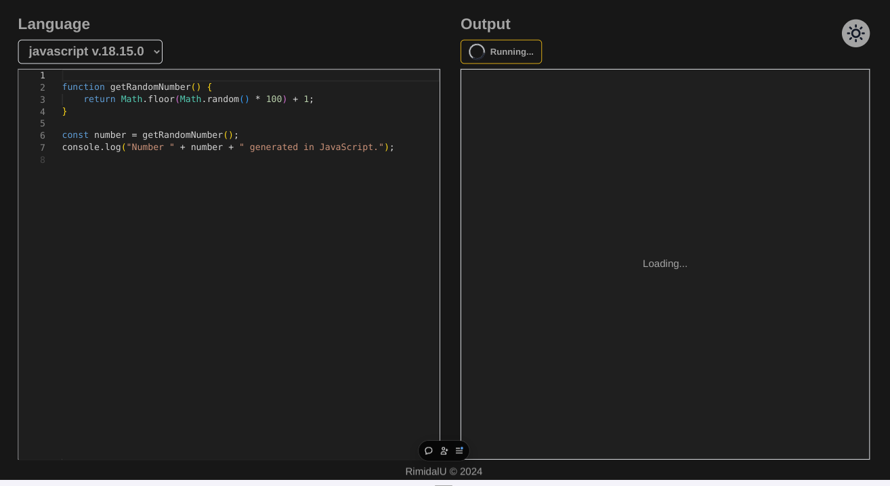
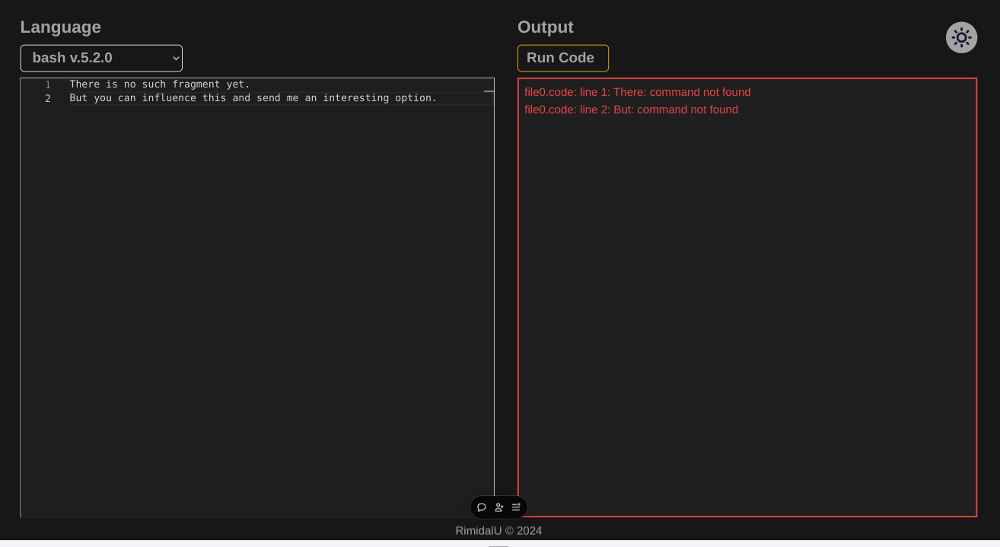
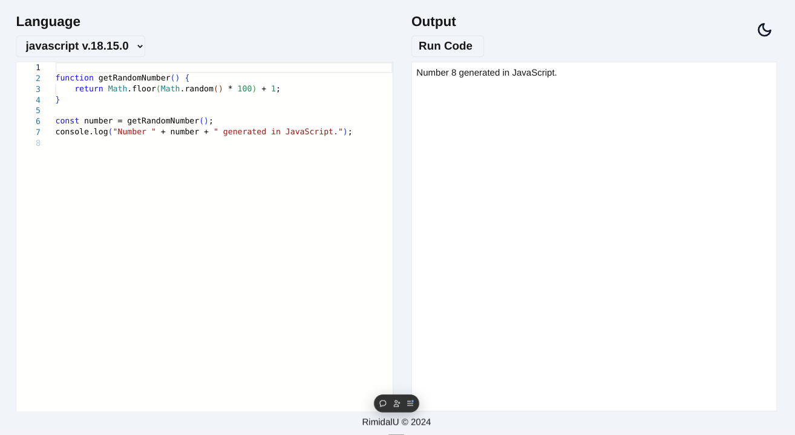
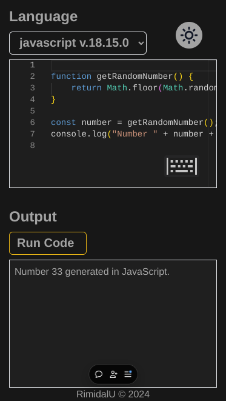

# QuickCode

> QuickCode - compact and intuitive code editor designed for developers who value simplicity and efficiency.

[](https://quick-code-beta.vercel.app/)


---

[Description](#description) •
[Project setup](#project-setup) •
[Features](#features) •
[How To Use](#how-to-use) •
[Project Status](#project-status) •
[Room for Improvement](#room-for-improvement) •
[License](#license) •
[Contact](#contact)

  


## Description

Single page application in Next.js.

QuickCode - compact and intuitive code editor designed for developers who value simplicity and efficiency.

With its help, you can quickly write, edit and test code without being distracted by unnecessary actions.

Stack: Next, TypeScript, TailwindCSS, Monaco-editor.

## Project setup

- Clone this repo to your desktop and run `npm install` to install all the dependencies.
- Once the dependencies are installed, you can run `npm run dev` to start the application.
- Enjoy.

### Project structure

```shell
.
├── .github                         # GitHub configuration
├── .husky                          # Husky settings for Git hooks
├── .vscode                         # Visual Studio Code configuration
├── public                          # Public static files
├── src                             # Source code of the application
│   ├── app                         # Main application component (Next.js)
│   ├── components                  # Reusable React components
│   ├── contexts                    # Contexts for state management
│   ├── models                      # Data model definitions
│   ├── services                    # Services for API interactions and logic
│   ├── utils                       # Utility functions and helpers
├── tailwind.config.js              # Tailwind CSS configuration
└── tsconfig.json                   # TypeScript configuration
```

## Features

- Deploying to Vercel;
- `Monaco-editor` library to work with code;
- `husky` and hooks (lint in _pre-commit_, check commit message);
- [Piston API for executing user-defined code.](https://piston.readthedocs.io/en/latest/api-v2/)
- Sonner toast component;

## How To Use

Run [Live Demo](https://quick-code-beta.vercel.app/)

<video src="https://github.com/RimidalU/QuickCode/blob/main/.github/assets/demo.mp4" controls="controls"></video>

## Project Status

Project is: _in progress_

## Room for Improvement

To do:

- [ ] Add theme switcher.
- [x] Add toaster.
- [ ] ...

Improvement:

- [ ] ...

## License

This project is open source and available under the [BSD 3-Clause](../LICENSE.md).

## Contact

Created by [@RimidalU](https://www.linkedin.com/in/uladzimir-stankevich/) - feel free to contact me!

<p align="right"><a href="#start"></a></p>

<!-- MARKDOWN LINKS & IMAGES -->

<!-- [tutorial]: ./assets/demo.mp4 -->
